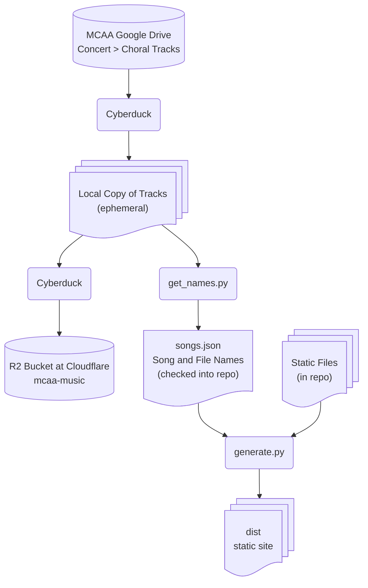

# mcaa-music

Website to access practice recordings for the Maui Choral Arts Association.

The site is hosted at Cloudflare at [mcaa-music.org](https://mcaa-music.org).

## Data Flow

The music is kept in MCAA's Google Drive.  The code and related files, such as 
this one, are kept in Github.



## Development

### Mermaid Diagrams

I'm sticking with free tools that run locally.  To edit mermaid diagrams, I install 
the mermaid CLI locally, copy the file to an `.mmd` file, edit with emacs, use `mmdc` 
to create a PNG file, and then look at the file.

## Setting up on Cloudflare

Cloudflare docs:

 - [Git Integration](https://developers.cloudflare.com/pages/get-started/git-integration/)
 - [Functions](https://developers.cloudflare.com/pages/functions/get-started/)

Updates:

 - Created `wrangler.jsonc` based on error message suggestion during deploy.
 - Set name in `wrangler.jsonc` to `mcaa-music`, as suggested by error message
 - Set assets dir to build output dir: `npx wrangler deploy --assets ./dist/`
 
### Setting up R2 Storage

#### R2

 - Turned on R2 storage for my account
 - Created a bucket called `mcaa-music` in the Western North America region.
 - Account id is: `fdd3cf56706534b30dee40ec7465bace`
 - Endpoint is: `https://fdd3cf56706534b30dee40ec7465bace.r2.cloudflarestorage.com` 
 
#### Cyberduck to upload files

 - "Open Connection" didn't work
 - creating a new bookmark did work, using the hostname, access key, and secret
 
#### Cloudflare

Add stanza to `wrangler.jsonc`:

```json
    "r2_buckets": [
        {
            "binding": "music",
            "bucket_name": "mcaa-music"
        }
    ]
```

